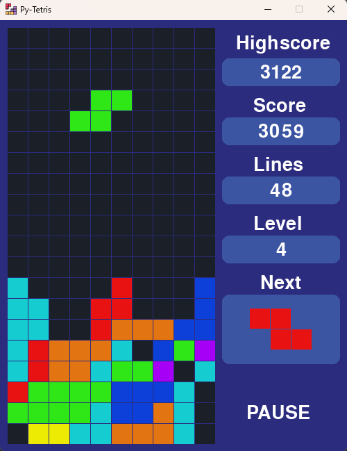

# py-tetris
Clone The Tetris Video Game in Python

© 2023 All right reserved.

Game builded with [Pygame Library](https://www.pygame.org).

Key controls:

- Q: quit game
- ENTER: pause / resume game
- S: move piece to down
- A: move piece to left
- D: move piece to right
- W: rotate piece
- Arrow Down: move piece to down
- Arrow Left: move piece to left
- Arrow Right: move piece to right
- Arrow Up: rotate piece
- SPACE: move piece to floor

System Requirements:

- Python 3.12 or higher
- Pygame library 2.5.2 or higher
  
